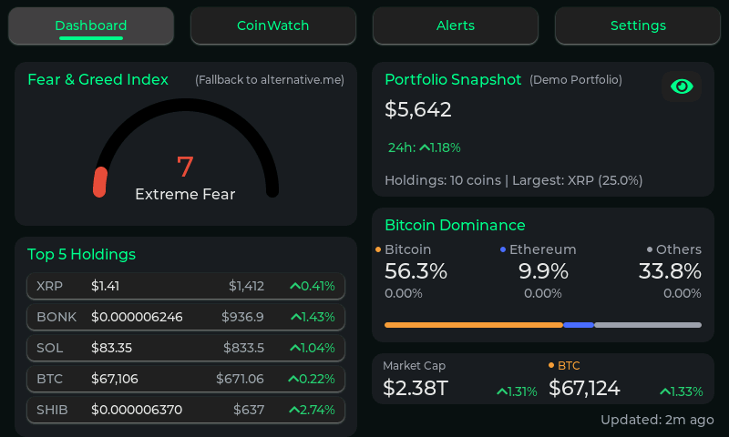
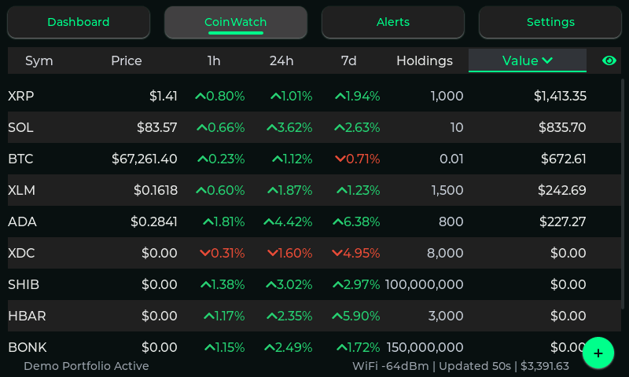
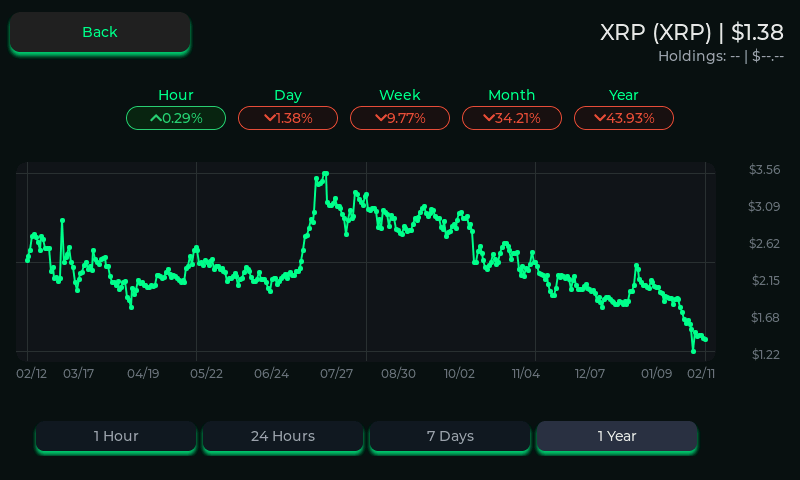
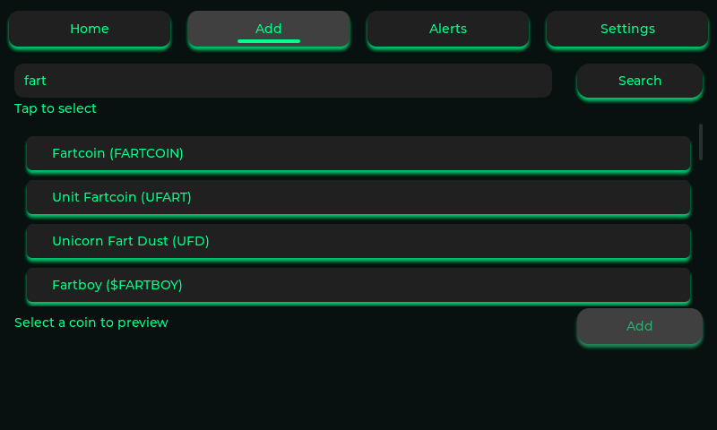
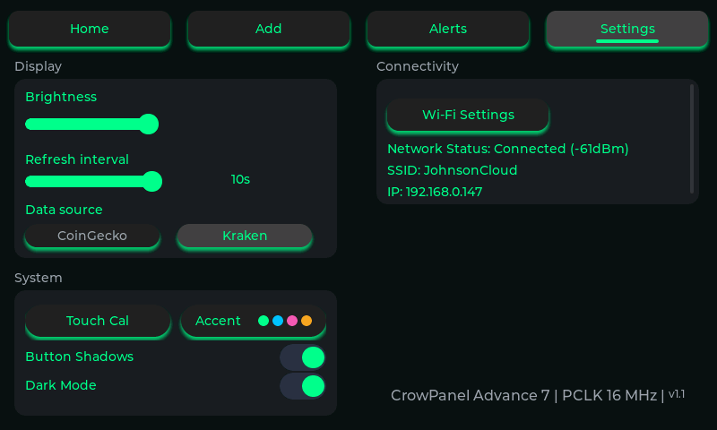
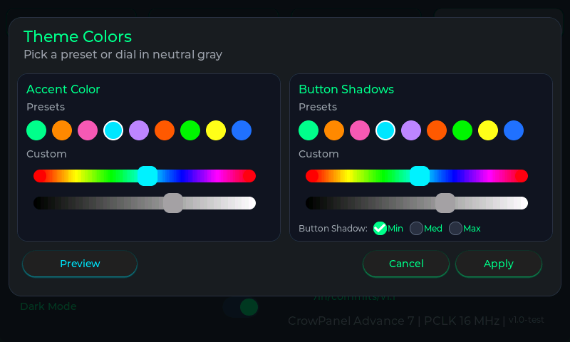
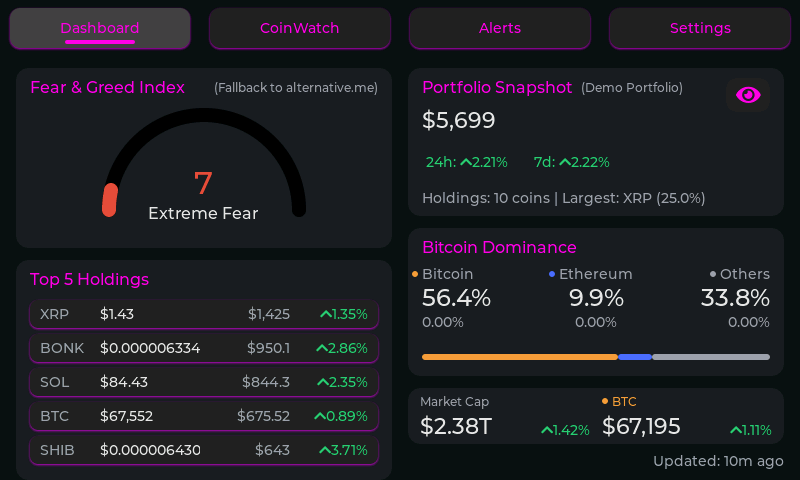

# CryptoTracker

Disclaimer: This is a personal side project fully coded by AI (I'm not a developer) and shared to help others get their devices up and running.

[](https://github.com/jaydawgx7/CryptoTracker_7in/actions)

ESP-IDF + LVGL crypto portfolio tracker for the Elecrow CrowPanel Advance 7.0" ESP32-S3 (PCB V1.3).

Repo: https://github.com/jaydawgx7/CryptoTracker_7in

## Highlights

- Dashboard + CoinWatch split with portfolio snapshot, market sentiment, and macro cards.
- Fear & Greed service with CoinMarketCap primary source, persistent cooldown, and alternative.me fallback.
- Demo Portfolio mode for screenshot-safe demos (real portfolio preserved).
- Modern LVGL UI: watchlist, coin detail, add coin, alerts, dashboard, settings, themes.
- Persistent preferences (theme, sorting, refresh cadence, privacy mode, brightness, demo toggle).
- GitHub Releases OTA updates with rollback support.
- Web endpoints for screenshot capture and watchlist backup/restore.

## Build and Flash (PlatformIO)

1. Open the project in VS Code with PlatformIO installed.
2. Set the correct serial port in PlatformIO if needed.
3. Build and upload:

```
pio run
pio run -t upload
pio device monitor -b 115200
```

## First Run Flow

- Boot to Home.
- Open Settings and confirm touch and brightness controls respond.
- Connect WiFi (Settings -> WiFi).
- Add coins from Add Coin.

## Screenshots

<table width="100%" cellpadding="12">
  <tr>
    <td></td>
    <td></td>
  </tr>
  <tr>
    <td></td>
    <td></td>
  </tr>
  <tr>
    <td></td>
    <td></td>
  </tr>
  <tr>
    <td></td>
    <td></td>
  </tr>
</table>

## Features

### Dashboard
- Portfolio Snapshot with totals and market summary.
- Fear & Greed card with live source transparency when fallback is active.
- Demo mode indicator when Demo Portfolio is enabled.

### CoinWatch
- Watchlist with sorting (Symbol, Price, 1h, 24h, 7d, Value).
- Long-press row actions: edit holdings, alerts, pin, remove.
- Show values toggle (privacy mode).
- Footer state indicator for Demo Portfolio mode.

### Coin Detail
- Title with live price, holdings/value summary.
- Percent chips: 1h, 24h, 7d, 30d, 1y.
- Chart with axis labels + range buttons.

### Add Coin
- Search and add from supported symbols.
- Fast quantity entry with persisted watchlist state.

### Settings
- WiFi manager.
- Brightness slider (control MCU).
- Theme and UI preferences.
- Refresh interval.
- Demo Portfolio toggle in Firmware Update card.
- Buzzer test.
- Firmware update via GitHub Releases (check + install).

## Web Endpoints

- `GET /` simple page with screenshot and watchlist tools.
- `GET /screenshot.bmp` current framebuffer screenshot.
- `GET /watchlist.json` download watchlist JSON.
- `POST /watchlist.json` upload watchlist JSON.
- `POST /ota` OTA install from JSON body `{ "url": "http://.../firmware.bin" }`.
- `GET /ota/status` OTA progress JSON.

## OTA via GitHub Releases

1. Build the firmware:

```
pio run
```

2. Find the binary:

```
.pio/build/esp32-s3-devkitc-1/firmware.bin
```

3. Create a GitHub Release and upload the `firmware.bin` asset.
   - Tag should be `vMAJOR.MINOR.PATCH` (example: `v1.2.3`).
   - Asset name can be anything as long as it ends with `.bin`.

4. On the device, open Settings -> Firmware Update and tap "Check for update".
5. If an update is available, tap "Install vX.Y.Z".

## Release Checklist

- Update `APP_VERSION` in [src/app_version.h](src/app_version.h).
- Build the project and verify it boots on hardware.
- Run the release script or create a release manually.
- Verify the release contains `firmware.bin` and screenshots render.

## Release Script

A PowerShell helper is available at [scripts/release.ps1](scripts/release.ps1).

Example:

```
./scripts/release.ps1 -Version v1.2.0
```

## Data Sources

- Kraken REST ticker provides prices and 24h change.
- CoinGecko provides percent sync (1h/24h/7d/30d/1y) and full fallback when Kraken is missing or fails.
- Dynamic Kraken pair mapping from AssetPairs for non-static symbols.

## Hardware Notes

- I2C uses GPIO15 (SDA) and GPIO16 (SCL).
- Touch controller is GT911-class on address `0x5D` with INT on GPIO1.
- Brightness and buzzer controlled by the V1.3 control MCU at `0x30`.
- V1.3 control MCU commands:
  - Brightness: 0 = max, 244 = min, 245 = off.
  - Buzzer: 246 = on, 247 = off.

## Display + Touch (Working Configuration)

This project uses the ESP-IDF RGB panel driver with a tuned timing profile for the CrowPanel Advance 7". LVGL uses a vertical offset to compensate for panel alignment. Touch input uses the ESP `esp_lcd_touch_gt911` component with runtime calibration.

### Display
- Panel: 800x480, RGB interface (`esp_lcd_panel_rgb`).
- Pixel clock: 16 MHz with PLL240M source.
- Timing: HSYNC 4/40/40, VSYNC 10/30/1, `pclk_active_neg=1`.
- Bounce buffer enabled (10 * H_RES).
- LVGL vertical compensation: `ver_res = 480 + 40`, `offset_y = -40`.

### Touch
- Driver: `esp_lcd_touch` + `esp_lcd_touch_gt911` (vendored under `components/`).
- I2C address: 0x5D, INT: GPIO1.
- INT wake pulse applied before touch init.
- Register address byte swap disabled for `esp_lcd_panel_io_i2c`.

### Calibration Flags (platformio.ini)
- `CT_TOUCH_CAL_X_MIN`, `CT_TOUCH_CAL_X_MAX`
- `CT_TOUCH_CAL_Y_MIN`, `CT_TOUCH_CAL_Y_MAX`
- `CT_TOUCH_OFFSET_Y`
- `CT_TOUCH_PHYS_V_RES=480`
- `CT_TOUCH_TARGET_V_RES=520`

If touch feels vertically stretched, adjust `CT_TOUCH_CAL_Y_MAX` by small increments. If the entire touch map is shifted, adjust `CT_TOUCH_OFFSET_Y`.
