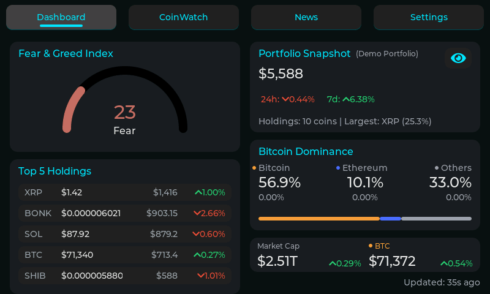
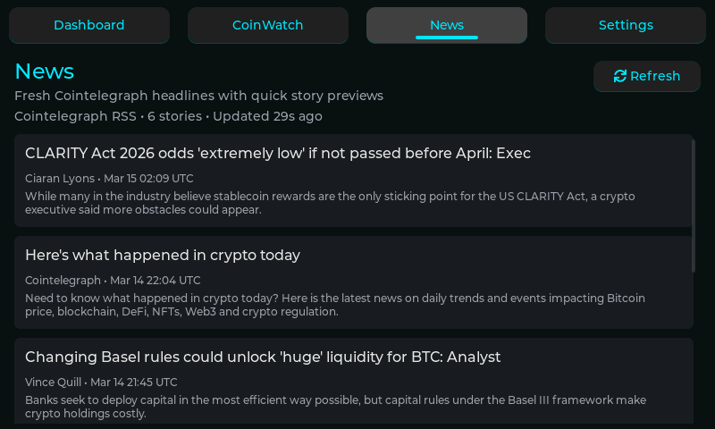

# CryptoTracker for Elecrow CrowPanel Advance 7.0

Disclaimer: This is a personal side project built for the Elecrow CrowPanel Advance 7.0" ESP32-S3 and heavily iterated with AI assistance. It is shared to help others get the display up and running faster.

[](https://github.com/jaydawgx7/CryptoTracker_7in/actions)

CryptoTracker is an ESP-IDF + LVGL crypto portfolio dashboard for the Elecrow CrowPanel Advance 7.0" (PCB V1.3). It combines a touch-friendly dashboard, CoinWatch, Coin Detail charts, a News tab, WiFi setup, OTA updates, theme controls, alerts, and a Demo Portfolio mode for safe public demos.

Repo: https://github.com/jaydawgx7/CryptoTracker_7in

## v2.0 Highlights

- Dedicated News tab with Cointelegraph headlines and article previews.
- Stable Coin Detail chart loading with async fetches, cached chart data, and loading overlays.
- Dashboard + CoinWatch split for portfolio overview and detailed watchlist management.
- Demo Portfolio mode for showing the project without exposing real holdings.
- Improved long-session stability from UI rendering and network request tuning.
- OTA updates from GitHub Releases.

## Device Target

- Device: Elecrow CrowPanel Advance 7.0"
- MCU: ESP32-S3-WROOM-1-N16R8
- Display: 800x480 RGB
- Touch: GT911-class capacitive touch
- Board revision: V1.3

## Main Screens

- Dashboard with portfolio summary, market mood, holdings breakdown, and top holdings.
- CoinWatch with sortable watchlist columns and long-press actions.
- Coin Detail with range buttons, time-axis chart, holdings summary, and change chips.
- News tab with Cointelegraph headlines and in-app article preview overlay.
- Add Coin search screen.
- Settings for WiFi, brightness, themes, refresh tuning, buzzer, Demo Portfolio, and OTA.

## Screenshots

<table width="100%" cellpadding="12">
  <tr>
    <td></td>
    <td></td>
  </tr>
  <tr>
    <td></td>
    <td></td>
  </tr>
  <tr>
    <td></td>
    <td></td>
  </tr>
  <tr>
    <td></td>
    <td></td>
  </tr>
  <tr>
    <td></td>
    <td></td>
  </tr>
</table>

## Features

### Dashboard
- Portfolio Snapshot with totals and market summary.
- Fear & Greed card with live source transparency when fallback is active.
- Demo indicator when Demo Portfolio is enabled.
- Top 5 holdings card with tap for detail and hold for edit.

### CoinWatch
- Sortable watchlist: Symbol, Price, 1h, 24h, 7d, Holdings, Value.
- Long-press row actions: edit holdings, alerts, pin, remove.
- Press feedback and improved touch handling for tap vs hold vs scroll.
- Footer indicator for Demo Portfolio mode.

### Coin Detail
- Live title, holdings/value summary, and percent chips.
- Chart ranges: 1H, 24H, 7D, 30D, 1Y.
- Async chart loading with spinner overlay.
- Cached chart data with retry-safe refresh behavior.
- Local-time x-axis labels via configurable timezone flag.

### News
- Cointelegraph RSS headlines in a dedicated News tab.
- Loading overlay, refresh button, cached snapshot behavior, and article detail overlay.
- Safe screen recreation and revisit handling.

### Add Coin
- Search and add supported coins quickly.
- Persistent watchlist state.

### Settings
- WiFi manager.
- Brightness slider via control MCU.
- Dark mode and accent/theme customization.
- Refresh interval and data-source controls.
- Demo Portfolio toggle with immediate real-portfolio reload.
- Buzzer test.
- GitHub OTA update check and install flow.

## Build and Flash (PlatformIO)

1. Open the project in VS Code with PlatformIO installed.
2. Confirm the device is on the expected serial port.
3. Build, upload, and monitor:

```
pio run --environment esp32-s3-devkitc-1-release
pio run --target upload --environment esp32-s3-devkitc-1-release
pio device monitor -b 115200
```

## First Run Flow

1. Boot to Dashboard or CoinWatch.
2. Open Settings and verify brightness and touch response.
3. Connect WiFi in Settings.
4. Add coins from Add Coin.
5. Optionally enable Demo Portfolio before showing the project publicly.
6. Open News to verify headlines load.

## Data Sources

- Kraken REST ticker provides prices and 24h change.
- CoinGecko provides percent sync (1h/24h/7d/30d/1y), chart data, and full fallback when needed.
- Cointelegraph RSS powers the News tab.

## Web Endpoints

- `GET /` simple page with screenshot and watchlist tools.
- `GET /screenshot.bmp` current framebuffer screenshot.
- `GET /watchlist.json` download watchlist JSON.
- `POST /watchlist.json` upload watchlist JSON.
- `POST /ota` OTA install from JSON body `{ "url": "http://.../firmware.bin" }`.
- `GET /ota/status` OTA progress JSON.

## OTA via GitHub Releases

1. Build the release firmware:

```
pio run --environment esp32-s3-devkitc-1-release
```

2. The release binary is generated at:

```
.pio/build/esp32-s3-devkitc-1-release/firmware.bin
```

3. Create a GitHub Release and upload `firmware.bin`.
4. On the device, open Settings -> Firmware Update and tap `Check for update`.
5. Install the available release when shown.

## Release Checklist

- Update `APP_VERSION` in [src/app_version.h](src/app_version.h).
- Update `CT_BUILD_BRANCH_STR` in [platformio.ini](platformio.ini) when needed.
- Review screenshots and README before tagging.
- Build the release environment and verify hardware boot.
- Run [scripts/release.ps1](scripts/release.ps1) or release manually from `main`.

## Release Script

A PowerShell helper is available at [scripts/release.ps1](scripts/release.ps1).

Example:

```
./scripts/release.ps1 -Version v2.0
```

## Hardware Notes

- I2C uses GPIO15 (SDA) and GPIO16 (SCL).
- Touch controller is GT911-class on address `0x5D` with INT on GPIO1.
- Brightness and buzzer are controlled by the V1.3 control MCU at `0x30`.
- V1.3 control MCU commands:
  - Brightness: 0 = max, 244 = min, 245 = off.
  - Buzzer: 246 = on, 247 = off.

## Display + Touch (Working Configuration)

This project uses the ESP-IDF RGB panel driver with a tuned timing profile for the CrowPanel Advance 7.0". LVGL uses a vertical offset to compensate for panel alignment. Touch input uses the vendored `esp_lcd_touch_gt911` component with runtime calibration support.

### Display
- Panel: 800x480, RGB interface (`esp_lcd_panel_rgb`).
- Pixel clock: 16 MHz with PLL240M source.
- Timing: HSYNC 4/40/40, VSYNC 10/30/1, `pclk_active_neg=1`.
- Bounce buffer enabled (10 * H_RES).
- LVGL vertical compensation: `ver_res = 480 + 40`, `offset_y = -40`.

### Touch
- Driver: `esp_lcd_touch` + `esp_lcd_touch_gt911` (vendored under `components/`).
- I2C address: 0x5D, INT: GPIO1.
- INT wake pulse applied before touch init.
- Register address byte swap disabled for `esp_lcd_panel_io_i2c`.

### Key Build Flags
- `CT_TOUCH_CAL_X_MIN`, `CT_TOUCH_CAL_X_MAX`
- `CT_TOUCH_CAL_Y_MIN`, `CT_TOUCH_CAL_Y_MAX`
- `CT_TOUCH_OFFSET_X`, `CT_TOUCH_OFFSET_Y`
- `CT_TOUCH_PHYS_V_RES=480`
- `CT_TOUCH_TARGET_V_RES=520`
- `CT_LOCAL_TZ` for chart local-time labels

If touch feels vertically stretched, adjust `CT_TOUCH_CAL_Y_MAX` in small steps. If the touch map is shifted, adjust `CT_TOUCH_OFFSET_Y`.
